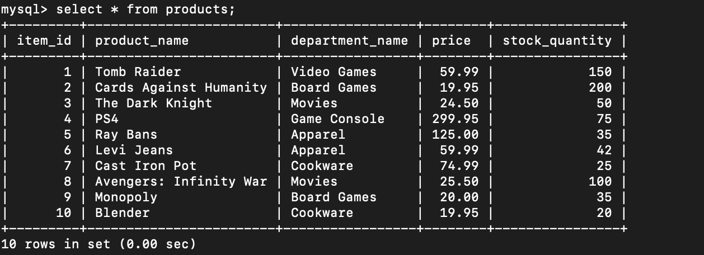
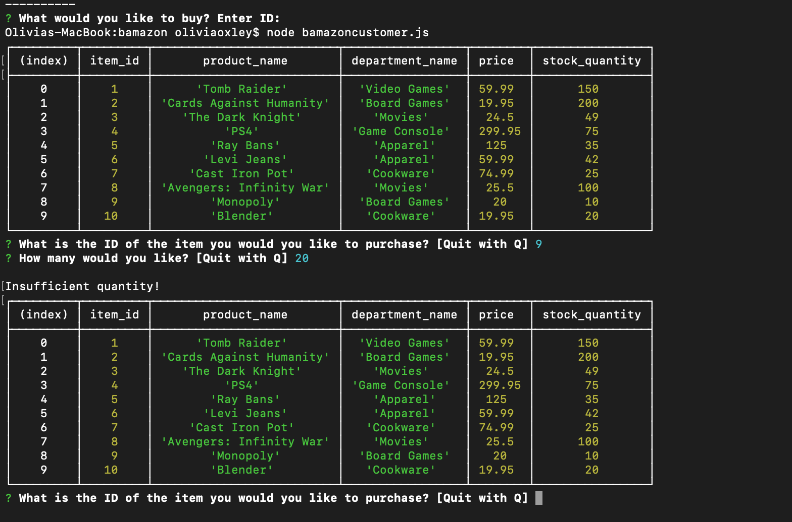
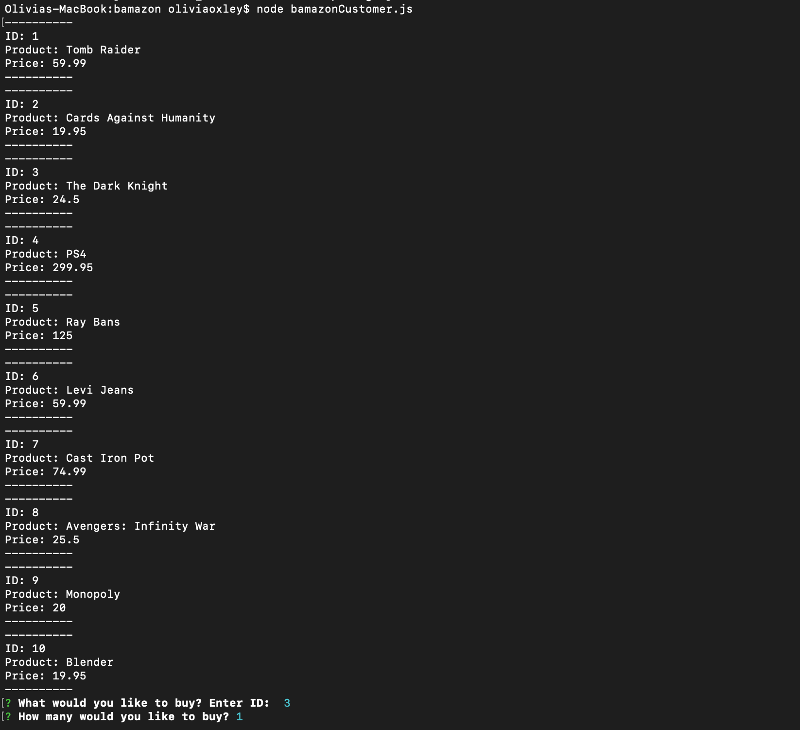

## Instructions

4. Populate this database with around 10 different products. (i.e. Insert "mock" data rows into this database and table).

5. Then create a Node application called `bamazonCustomer.js`. Running this application will first display all of the items available for sale. Include the ids, names, and prices of products for sale.

   * If not, the app should log a phrase like `Insufficient quantity!`, and then prevent the order from going through.

8. However, if your store _does_ have enough of the product, you should fulfill the customer's order.
   * This means updating the SQL database to reflect the remaining quantity.
   * Once the update goes through, show the customer the total cost of their purchase.

